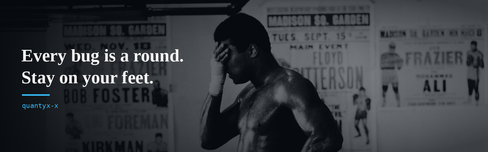

```js
Identity = {
  Alias: quantyx-x,
  Handle: ahmed-init,
  Occupation: 2nd Year CSE Student,
  Focus: "Backend + GenAI"
};

Arsenal = {
  Editors: VS Code | IntelliJ IDEA,
  Tools: Git | Docker | Postman | Maven | Linux,
  Cloud: AWS
};

Interests = [
  Generative AI | RAG,
  LLMs | AI Agents,
  Backend Engineering | REST APIs,
  System Design | Distributed Systems,
  Vector Databases | Open Source
];

Languages = {
  Primary: Python | Java,
  Secondary: C | JavaScript/TypeScript | SQL,
  Preference: Backend
};

Frameworks = {
  Backend: FastAPI | Spring Boot | Node.js,
  Databases: MySQL | MongoDB | ChromaDB,
  AI: LangChain | Hugging Face | Sentence Transformers | Ollama | OpenRouter
};

Status = {
  Learning: AI Agents | System Design | AWS | Distributed Systems,
  Building: "Production-ready AI applications",
  Currently: GenAI Multi-Agent Copilot | RAG Insurance Assistant
};

Projects = {
  GenAI Multi-Agent Copilot: "FastAPI app routing requests to specialized AI agents via OpenRouter",
  RAG Insurance Assistant: "Semantic search + RAG over insurance policies (ChromaDB, LangChain)",
  Employee Leave Management: "Backend API with auth, leave workflows, MySQL (FastAPI, SQLAlchemy)",
  Rate Limiter: "API rate limiter using <algorithm> (<stack>)"
};

Goal = "Build scalable AI products and contribute to impactful open source";
```

Let's Build Something Meaningful: [LinkedIn](https://linkedin.com/in/ahamed-jaseem-j-8aab52329) | [Email](mailto:YOUR_EMAIL)
