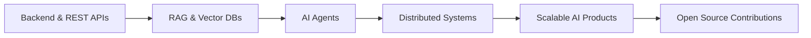

  <!-- ===================== HEADER ===================== -->
<div align="center">


<a href="https://git.io/typing-svg">
  
</a>

<br/>


</div>

---

## 👨‍💻 About Me

```python
class QuantyxX:
    alias      = "quantyx-x"
    handle     = "ahmed-init"
    role       = "3rd Year CSE Student"
    focus      = "System Design"
    currently  = ["AI Agents", "System Design", "Distributed Systems"]
    building   = "Production-ready AI applications"
    goal       = "Build scalable AI products & contribute to open source"

    def motto(self):
        return "Make it work. Make it right. Make it scale."
```

---

## 🛠️ Tech Stack

**Languages**


**Backend & Frameworks**


**Databases**


**AI / GenAI**


**Tools & DevOps**


---

## 🚀 Featured Projects

<table>
  <tr>
    <td width="50%" valign="top">

### 🤖 GenAI Multi-Agent Copilot
Routes each request to the right specialized AI agent.

`FastAPI` `OpenRouter` `Multi-Agent`

    </td>
    <td width="50%" valign="top">

### 🛡️ RAG Insurance Assistant
Ask questions about insurance policies and get answers using semantic search.

`ChromaDB` `LangChain` `RAG`

    </td>
  </tr>
  <tr>
    <td width="50%" valign="top">

### 🗂️ Employee Leave Management
Backend API with authentication and leave approval workflows.

`FastAPI` `SQLAlchemy` `MySQL`

    </td>
    <td width="50%" valign="top">

### ⏱️ API Rate Limiter
Protects APIs from too many requests using the Token Bucket algorithm.

`Node.js` `Redis` `Token Bucket`

    </td>
  </tr>
</table>

---

## 🎯 What I'm Focused On

| 🔭 Learning | 🔨 Building | 💡 Exploring |
|:--|:--|:--|
| AI Agents | Production-ready AI apps | Linux Kernel |
| System Design | Scalable backend systems | Vector Databases |
| Distributed Systems | REST APIs | Open Source |

---

## 📊 GitHub Stats

<div align="center">


<br/>


</div>

---

## 🗺️ My Roadmap


```mermaid
flowchart LR
    A[Backend & REST APIs] --> B[RAG & Vector DBs]
    B --> C[AI Agents]
    C --> D[Distributed Systems]
    D --> E[Scalable AI Products]
    E --> F[Open Source Contributions]
```

---

## 🤝 Let's Connect

<div align="center">

[](https://linkedin.com/in/ahamed-jaseem-j-8aab52329)
[](mailto:YOUR_EMAIL)
[](https://github.com/ahmed-init)

### ✨ *Let's build something meaningful.* ✨

</div>


